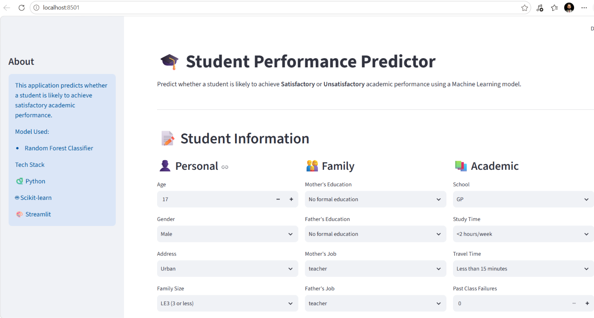
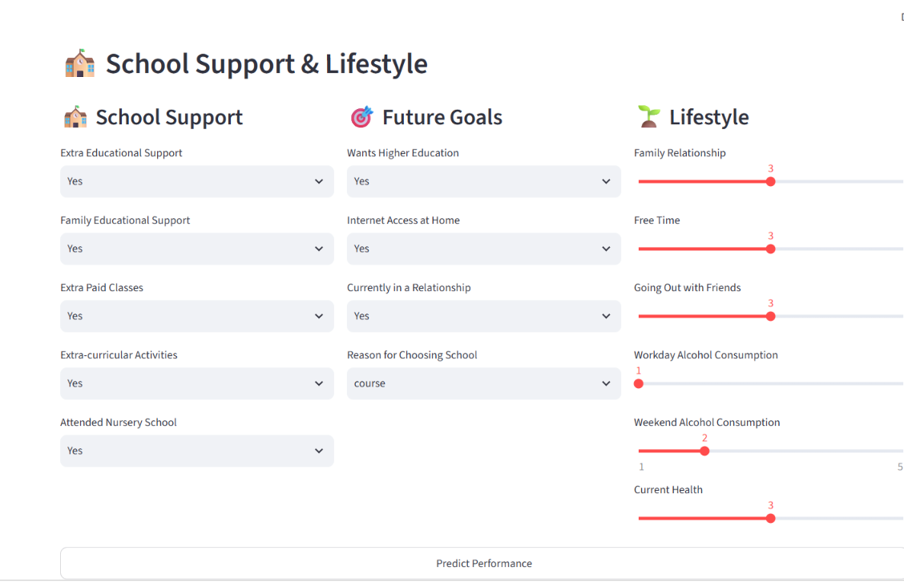
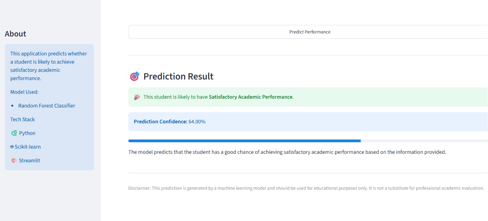
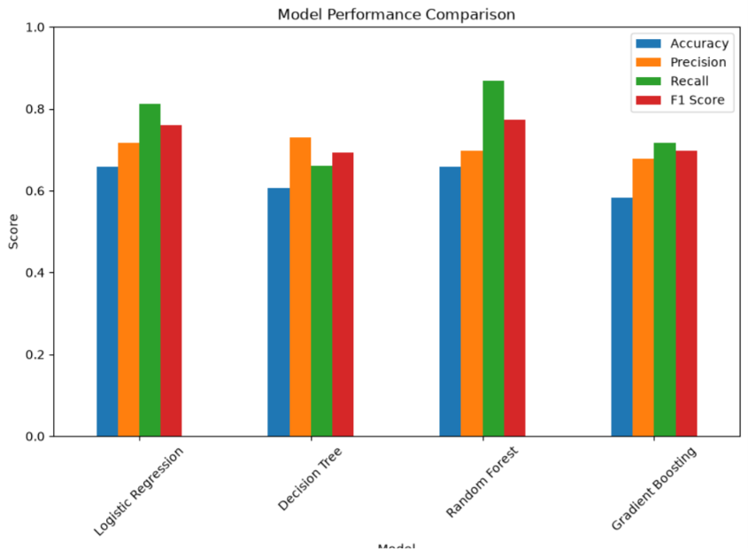

# 🎓 Student Performance Prediction using Machine Learning

## 📌 Project Overview

This project predicts whether a student is likely to achieve **Satisfactory** or **Unsatisfactory** academic performance based on demographic, family, academic, and lifestyle factors.

The application uses a Machine Learning pipeline trained on the Student Performance Dataset and provides predictions through an interactive Streamlit web application.

## ✨ Features

- Interactive Streamlit web application
- Predicts student academic performance
- User-friendly input form
- Machine Learning Pipeline for preprocessing and prediction
- Confidence score for every prediction
- Clean and responsive interface

## 📷 Application Preview

### Home Page



### Input Form



### Prediction Result



## 📊 Dataset

The project uses the Student Performance Dataset containing demographic, social, family, and academic information of students.

The target variable is created from the final grade (G3):

- Satisfactory Performance (G3 ≥ 10)
- Unsatisfactory Performance (G3 < 10)

The original G3 column is removed after creating the target variable to avoid data leakage.

## 🔄 Project Workflow

1. Data Collection
2. Data Cleaning
3. Exploratory Data Analysis (EDA)
4. Feature Selection
5. Data Preprocessing
6. Model Training
7. Model Comparison
8. Model Selection
9. Pipeline Creation
10. Streamlit Application
11. Deployment

## 🤖 Machine Learning Pipeline

The project uses a Scikit-learn Pipeline that combines:

- ColumnTransformer
- StandardScaler
- OneHotEncoder
- Random Forest Classifier

Using a pipeline ensures consistent preprocessing during both training and prediction while preventing data leakage.

## 📈 Model Performance

| Model | Accuracy | Precision | Recall | F1 Score |
|--------|----------|-----------|---------|----------|
| Logistic Regression | 65.82% | 71.67% | 81.13% | 76.11% |
| Decision Tree | 60.76% | 72.92% | 66.04% | 69.31% |
| Gradient Boosting | 58.23% | 67.86% | 71.70% | 69.72% |
| **Random Forest** | **65.82%** | **69.70%** | **86.79%** | **77.31%** |

**Selected Model:** Random Forest Classifier




## 🛠 Technologies Used

- Python
- Pandas
- NumPy
- Scikit-learn
- Joblib
- Streamlit
- Matplotlib

## ⚙ Installation


Clone the repository

```bash
git clone <repository-url>

cd student_performance_prediction

pip install -r requirements.txt

```
## ▶ Run the Application

```bash
python -m streamlit run app.py

This is especially useful because it avoids PATH issues.
```
## 🚀 Future Improvements

- Improve UI design
- Add probability visualization
- Support batch predictions using CSV upload
- Explain predictions using SHAP values
- Deploy using Docker
- Add user authentication

## 👨‍💻 Author

**Mohsin Shafait**

GitHub: https://github.com/mohsinshafait

## 📚 Key Learning Outcomes

During this project, I gained practical experience in:

- Exploratory Data Analysis (EDA)
- Feature engineering and preprocessing
- Building Scikit-learn Pipelines
- Comparing multiple classification models
- Preventing data leakage
- Developing interactive ML applications with Streamlit
- Deploying machine learning applications